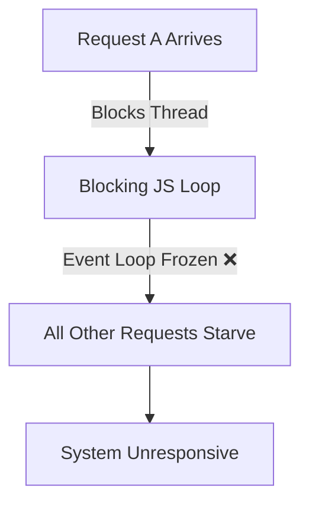

Here is the consolidated, production-grade guide to **Node.js Performance & Clustering**, merging the architectural concepts with practical implementation details.

---

# 🚀 Node.js Performance & Scaling Architecture

*(Covering Lecture Sections 020 - 025)*

This section shifts from understanding *internal* architecture to solving the real-world problem of scaling Node.js applications. We move from the theoretical "Single Thread" constraint to the practical "Multi-Core" solution.

---

## 1️⃣ Defining "Performance" in Node.js (01:47:33)

In the context of Node.js production systems, "performance" isn't just "fast code." It specifically refers to:

1. **Event Loop Responsiveness:** How quickly the loop ticks.
2. **Throughput:** Requests handled per second.
3. **Latency:** The delay a user experiences under load.


### The Golden Rules

To maintain performance, you must adhere to the Node.js hierarchy of scaling:

1. **Async I/O:** (Best) Let the OS kernel handle it.
2. **Thread Pool:** (Good) Let `libuv` threads handle file/crypto work.
3. **Worker Threads:** (Okay) Manually offload CPU work to a thread.
4. **Clustering:** (Scalable) Run multiple processes to use all CPU cores.

> **Critical Rule:** Never block the **Event Loop**. Node scales best by doing *less* work per request on the main thread.

---

## 2️⃣ Express & The Event Loop (01:49:51)

It is crucial to understand that **Express runs entirely on the main Event Loop**.

```js
const express = require("express");
const app = express();

app.get("/", (req, res) => {
  res.send("Hello");
});

app.listen(3000);

```

### Production Insight

* Express does **not** create threads for requests.
* Every request handler executes on the **same single JavaScript thread**.
* Therefore: **Express Performance = Event Loop Health.**

---

## 3️⃣ The Deadly Mistake: Blocking the Loop (01:53:13)

Since Node is single-threaded, a single heavy calculation can catastrophic failure for *all* users.

### The Blocking Code (`doWork`)

This function simulates a heavy CPU task (like image processing or large JSON parsing) by spinning the CPU in a `while` loop.

```js
const express = require('express');
const app = express();

function doWork(duration) {
  const start = Date.now();
  // 🛑 DANGER: This loop pauses the Event Loop entirely!
  while (Date.now() - start < duration) {}
}

app.get('/', (req, res) => {
  // Simulating 5 seconds of heavy CPU work
  doWork(5000); 
  res.send('Hi there');
});

app.listen(3000);

```

### The "Starvation" Effect

If **User A** hits this endpoint, the Event Loop stops.
If **User B** hits the server 1 second later:

1. User A occupies the thread for 5 seconds.
2. User B **cannot even connect**. Their request hangs in the TCP queue.
3. **Result:** User B waits 9 seconds (4s waiting for A + 5s for their own request).

**Visualizing the Block:**



---

## 4️⃣ The Solution: Clustering (02:00:20)

### The Limitation

By default: **One Node Process → One Event Loop → One CPU Core.**
If you have an 8-core server, standard Node.js leaves 7 cores idle.

### The Architecture

**Clustering** allows you to create copies of your Node application (Workers) that run simultaneously on the same machine, managed by a "Master" process.

* **Cluster Manager (Master):** The "Boss." Monitors health, forks workers. Does *not* handle HTTP traffic.
* **Worker Instances:** The "Employees." Each has its own **Memory** and **Event Loop**. They handle the traffic.

### Visual Architecture: Clustered Node Server

```mermaid
graph TD
    LB[Load Balancer / OS Port 3000] --> CM[Cluster Manager (Master)]
    
    subgraph "Server Hardware (4 Cores)"
    CM -->|Forks| W1[Worker 1 - Core 1]
    CM -->|Forks| W2[Worker 2 - Core 2]
    CM -->|Forks| W3[Worker 3 - Core 3]
    CM -->|Forks| W4[Worker 4 - Core 4]
    end

    W1 -->|Handles| R1[Request A]
    W2 -->|Handles| R2[Request B]
    W3 -->|Handles| R3[Request C]

```

---

## 5️⃣ Implementation: `cluster.js` (02:05:31)

We use the native `cluster` module. The code must differentiate between acting as the **Master** (forking) and acting as a **Worker** (serving).

```js
const cluster = require("cluster");
const os = require("os");
const express = require("express");

// Check if the current process is the Master (The Manager)
if (cluster.isMaster) {
  // 1. Determine how many logical cores the machine has
  const cpuCount = os.cpus().length;

  console.log(`Master ${process.pid} is running`);
  console.log(`Forking for ${cpuCount} CPUs...`);

  // 2. Create a worker for each CPU core
  for (let i = 0; i < cpuCount; i++) {
    cluster.fork(); // This executes this file again, but in "Worker" mode
  }
  
  // (Optional) Replace dead workers
  cluster.on('exit', (worker) => {
      console.log(`Worker ${worker.process.pid} died. Forking new one...`);
      cluster.fork();
  });

} else {
  // We are NOT Master, so we must be a Worker
  // 3. Define the actual Server Logic
  const app = express();

  function doWork(duration) {
    const start = Date.now();
    while(Date.now() - start < duration) {}
  }

  app.get("/", (req, res) => {
    // This blocks ONLY this specific worker
    doWork(5000);
    res.send(`Handled by Worker PID: ${process.pid}`);
  });

  app.get("/fast", (req, res) => {
    res.send("This was fast!");
  });

  // All workers share the same TCP connection (Port 3000)
  app.listen(3000);
}

```

---

## 6️⃣ Benchmarking & Results (02:11:09)

When testing the clustered solution against the blocking code:

**Without Clustering (Single Process):**

* 4 Requests sent simultaneously.
* Times: **5s, 10s, 15s, 20s**. (Sequential processing)

**With Clustering (4 Workers):**

* 4 Requests sent simultaneously.
* Times: **5s, 5s, 5s, 5s**. (Parallel processing)

### Comparison Table

| Feature | Single Process | Clustered Mode |
| --- | --- | --- |
| **CPU Usage** | 1 Core (100%), others idle | All Cores utilized |
| **Fault Tolerance** | Crash kills the server | Crash kills 1 worker (Master restarts it) |
| **Blocking Effect** | Blocks **all** users | Blocks **one** worker (others stay responsive) |
| **Complexity** | Low | Moderate (State management is harder) |

---

## 7️⃣ Critical Production Insight

**Clustering does not fix bad code.**

If you abuse synchronous APIs or block the Event Loop, clustering simply allows you to kill performance **one core at a time** instead of all at once. It increases *throughput*, but it does not decrease the *latency* of individual blocking operations.

### Final Check (Self-Test)

👉 **Why does clustering improve CPU-bound performance but NOT significantly improve I/O-bound performance?**

* **CPU-bound:** You are limited by raw processor speed. Adding cores (clustering) adds raw speed.
* **I/O-bound:** You are limited by the database or disk speed. Adding more Node processes just makes more processes *wait* for the same slow database.

**(Answer this correctly, and you have moved from Beginner → Production Expert on Node Architecture.)**

---

### Would you like to dive deeper into how `libuv` manages the Thread Pool inside these workers, or move on to Practical Project Setup?
